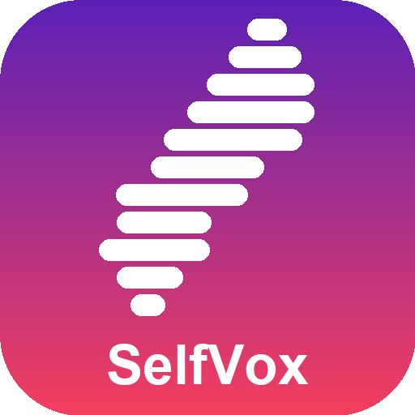
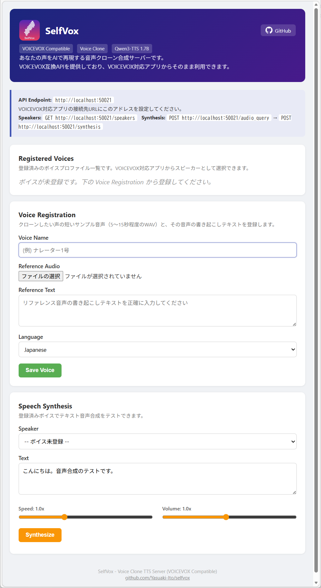

#  SelfVox

**[Qwen3-TTS](https://github.com/QwenLM/Qwen3-TTS) をかんたんに使える音声合成ツール**

Qwen3-TTS による音声クローン合成を、面倒な環境構築なしで利用できるツールです。
インストーラから導入して exe を起動するだけで、Python環境の構築からモデルのダウンロードまですべて自動で行われます。

ブラウザ上で声の登録と音声合成・WAVファイル保存ができるほか、VOICEVOX互換APIも備えているためVOICEVOX対応アプリからも利用できます。



## 特徴

- **環境構築不要** — exe起動でPython・PyTorch・モデルのセットアップがすべて自動
- **ブラウザで完結** — ボイス登録・音声合成・WAVダウンロードがブラウザUIだけでOK
- **複数話者** — 声のサンプルを複数登録して、話者を切り替えて使える
- **VOICEVOX互換API** — AviUtl、YMM4 などのVOICEVOX対応アプリからそのまま接続可能
- **完全ローカル動作** — 音声合成はすべてPC上で実行。テキストや音声データが外部に送信されることはありません

## 動作要件

- Windows 10/11 (64bit)
- NVIDIA GPU (VRAM 6GB以上推奨、CUDA 12.4 対応ドライバ)
  - GPUがない場合はCPUで動作しますが、合成速度が大幅に遅くなります
- インターネット接続 (初回起動時に環境構築・モデルダウンロードを自動実行するため)

## インストール

[Releases](https://github.com/Yasuaki-Ito/selfvox/releases) から最新の `SelfVox-Setup.exe` をダウンロードして実行してください。

## 使い方

### 1. 起動

`SelfVox.exe` をダブルクリックします。
起動するとブラウザが自動で開きます。

**初回起動時**は Python環境の構築 (インストーラ版) と Qwen3-TTS モデルのダウンロード (~4.5GB) が自動で行われます。2回目以降はすぐにサーバーが起動します。

停止するにはコンソールウィンドウで `Ctrl+C` を押すか、ウィンドウを閉じてください。

### 2. ボイス登録

ブラウザの管理画面 (http://localhost:50021) で:

1. **Voice Name** にボイス名を入力
2. **Reference Audio** にクローンしたい声のWAVファイル (5〜15秒) をアップロード
3. **Reference Text** にその音声の書き起こしテキストを入力
4. **Language** で言語を選択
5. **Save Voice** をクリック

### 3. 音声合成

#### ブラウザから

管理画面の「Speech Synthesis」セクションでスピーカーを選び、テキストを入力して **Synthesize** をクリックすると音声が再生されます。**Download WAV** で音声ファイルを保存できます。

#### VOICEVOX互換APIから

```
POST http://localhost:50021/audio_query?text=こんにちは&speaker=0
POST http://localhost:50021/synthesis?speaker=0
```

VOICEVOX対応アプリの接続先URLに `http://localhost:50021` を設定してください。

#### VOICEVOX対応アプリの例

動作確認済み:
- [PPVoice](https://github.com/Yasuaki-Ito/PPVoice) — PowerPoint読み上げ

未検証 (VOICEVOX互換APIに対応しているアプリ):
- [YMM4 (ゆっくりムービーメーカー4)](https://manjubox.net/ymm4/) — 動画編集・実況
- [AviUtl](http://spring-fragrance.mints.ne.jp/aviutl/) + [AoiSupport](https://aoi-chan.moe/aoisupport/) — 動画編集
- [Recotte Studio](https://www.ah-soft.com/rs/) — 実況動画作成
- [わんコメ (OneComme)](https://onecomme.com/) — 配信コメント読み上げ
- [棒読みちゃん](https://chi.usamimi.info/Program/Application/BouyomiChan/) + [SAPI For VOICEVOX](https://machanbazaar.com/voicevox-plugin/) — テキスト読み上げ
- [ゆかりねっとコネクターNEO](https://nmori.github.io/yncneo-Docs/) — リアルタイム字幕・翻訳

## APIエンドポイント

| エンドポイント | メソッド | 説明 |
|---|---|---|
| `/` | GET | ボイス管理画面 (Web UI) |
| `/speakers` | GET | スピーカー一覧 |
| `/audio_query` | POST | 音声クエリ作成 |
| `/synthesis` | POST | 音声合成 (WAV) |
| `/manage/voices` | GET | 登録済みボイス一覧 |
| `/manage/voice` | POST | ボイス登録 |
| `/manage/voice/{name}` | DELETE | ボイス削除 |

## ライセンス

[MIT License](LICENSE)

SelfVox はオープンソースの音声合成モデル [Qwen3-TTS](https://github.com/QwenLM/Qwen3-TTS) を使用しています。
モデルは初回起動時に元のリポジトリから自動でダウンロードされます。
SelfVox がモデルを配布・改変することはありません。
