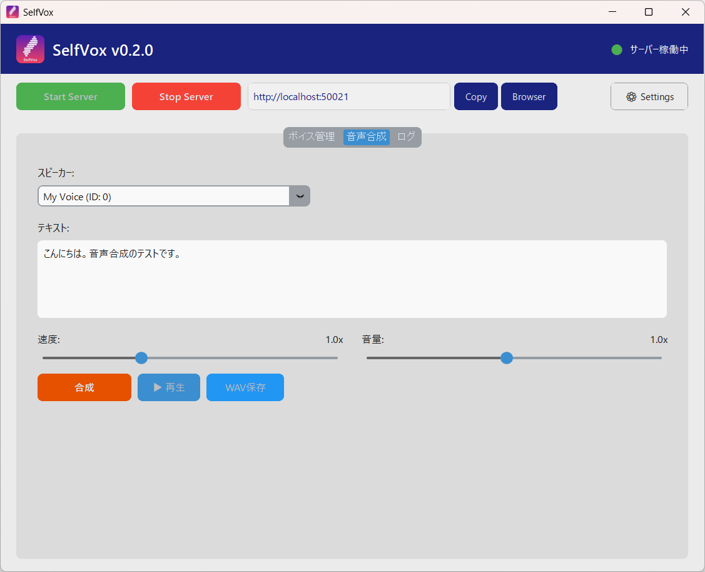

#  SelfVox

**[Qwen3-TTS](https://github.com/QwenLM/Qwen3-TTS) をかんたんに使える音声合成ツール**

Qwen3-TTS による音声クローン合成を、面倒な環境構築なしで利用できるツールです。
インストーラから導入して exe を起動するだけで、Python環境の構築からモデルのダウンロードまですべて自動で行われます。

デスクトップGUIで声の登録と音声合成・WAVファイル保存ができるほか、VOICEVOX互換APIも備えているためVOICEVOX対応アプリからも利用できます。



## 特徴

- **環境構築不要** — exe起動でPython・PyTorch・モデルのセットアップがすべて自動
- **デスクトップGUIで完結** — ボイス登録・音声合成・再生・WAV保存がGUIだけでOK
- **複数話者** — 声のサンプルを複数登録して、話者を切り替えて使える
- **VOICEVOX互換API** — [PPVoice](https://github.com/Yasuaki-Ito/PPVoice) 、AviUtl、YMM4 などのVOICEVOX対応アプリからそのまま接続可能
- **完全ローカル動作** — 音声合成はすべてPC上で実行。テキストや音声データが外部に送信されることはありません

## 動作要件

- Windows 11 (64bit)
- NVIDIA GPU (VRAM 6GB以上推奨、CUDA 12.4 対応ドライバ)
  - GPUがない場合はCPUで動作しますが、合成速度が大幅に遅くなります
- ストレージ空き容量 約10GB (PyTorch + CUDA ~5GB、音声合成モデル ~4.5GB)
- インターネット接続 (初回起動時に環境構築・モデルダウンロードを自動実行するため)

## インストール

[Releases](https://github.com/Yasuaki-Ito/selfvox/releases) から最新の `SelfVox-Setup.exe` をダウンロードして実行してください。

> **Windows SmartScreen の警告について**
> インストーラにコード署名がないため、「WindowsによってPCが保護されました」と表示されることがあります。
> 「詳細情報」→「実行」をクリックするとインストールを続行できます。

> **アップグレードする場合**
> 既存バージョンをアンインストールしてから再インストールしてください。
> Python環境から実行している場合は `.venv` を削除して `pip install -r requirements.txt` で再作成してください。

## 使い方

### 1. 起動

`SelfVox.exe` をダブルクリックします。
GUIウィンドウが表示されるので、**Start Server** をクリックしてサーバーを起動します。

**初回起動時**は Python環境の構築 (インストーラ版) と Qwen3-TTS モデルのダウンロード (~4.5GB) が自動で行われます。進捗はポップアップで表示されます。2回目以降はすぐにサーバーが起動します。

> **ポート番号について**
> SelfVox は VOICEVOX と同じポート番号 (`50021`) を使用します。VOICEVOX が起動している状態では SelfVox を起動できません。SelfVox を使う場合は、先に VOICEVOX を終了してください。

### 2. リファレンス音声の準備

クローンしたい声の短い音声ファイル (WAV) と、その書き起こしテキストを用意してください。

- 長さは **5〜15秒** 程度
- できるだけ **ノイズが少なく高音質** なもの
- 音声の先頭や末尾が **途中で途切れていないもの** (ぶつ切りの音声は生成結果にノイズが入る原因になります)
- テキストは音声の内容と **正確に一致** させてください

> **注意:** 他者の声を無断で使用することは、肖像権やパブリシティ権の侵害となる場合があります。リファレンス音声には **自分の声** または **使用許諾を得た音声** を使用してください。

### 3. ボイス登録

GUIの **ボイス管理** タブで:

1. **ボイス名** を入力
2. **リファレンス音声** の「ファイル選択」で用意した音声ファイルを選択
3. **リファレンスのテキスト** に書き起こしテキストを入力
4. **言語** を選択
5. **保存** をクリック

ボイス登録はサーバー停止中でも可能です。

### 4. 音声合成

GUIの **音声合成** タブで:

1. **スピーカー** を選択
2. テキストを入力
3. 必要に応じて **速度** / **音量** スライダーを調整
4. **合成** をクリック → 自動で再生されます
5. **WAV保存** でファイルに保存できます

#### VOICEVOX互換APIから

```
POST http://localhost:50021/audio_query?text=こんにちは&speaker=0
POST http://localhost:50021/synthesis?speaker=0
```

VOICEVOX対応アプリの接続先URLに `http://localhost:50021` を設定してください。

#### VOICEVOX対応アプリの例

動作確認済み:
- [PPVoice](https://github.com/Yasuaki-Ito/PPVoice) — PowerPoint読み上げ・字幕生成

未検証 (VOICEVOX互換APIに対応しているアプリ):
- [YMM4 (ゆっくりムービーメーカー4)](https://manjubox.net/ymm4/) — 動画編集・実況
- [AviUtl](http://spring-fragrance.mints.ne.jp/aviutl/) + [AoiSupport](https://aoi-chan.moe/aoisupport/) — 動画編集
- [Recotte Studio](https://www.ah-soft.com/rs/) — 実況動画作成
- [わんコメ (OneComme)](https://onecomme.com/) — 配信コメント読み上げ
- [棒読みちゃん](https://chi.usamimi.info/Program/Application/BouyomiChan/) + [SAPI For VOICEVOX](https://machanbazaar.com/voicevox-plugin/) — テキスト読み上げ
- [ゆかりねっとコネクターNEO](https://nmori.github.io/yncneo-Docs/) — リアルタイム字幕・翻訳

## APIエンドポイント

| エンドポイント | メソッド | 説明 |
|---|---|---|
| `/` | GET | ボイス管理画面 (Web UI) |
| `/speakers` | GET | スピーカー一覧 |
| `/audio_query` | POST | 音声クエリ作成 |
| `/synthesis` | POST | 音声合成 (WAV) |
| `/manage/voices` | GET | 登録済みボイス一覧 |
| `/manage/voice` | POST | ボイス登録 |
| `/manage/voice/{name}` | DELETE | ボイス削除 |
| `/manage/reload` | POST | ボイス一覧の再読み込み |

## ライセンス

[MIT License](LICENSE)

SelfVox はオープンソースの音声合成モデル [Qwen3-TTS](https://github.com/QwenLM/Qwen3-TTS) を使用しています。
モデルは初回起動時に元のリポジトリから自動でダウンロードされます。
SelfVox がモデルを配布・改変することはありません。
